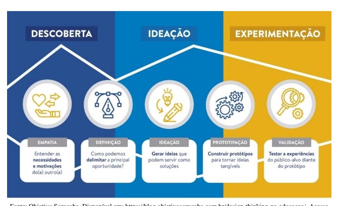
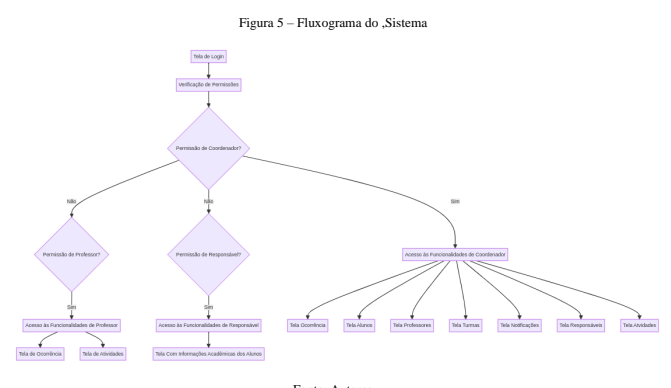
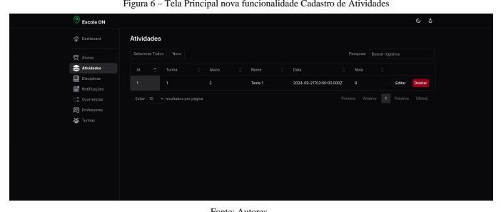
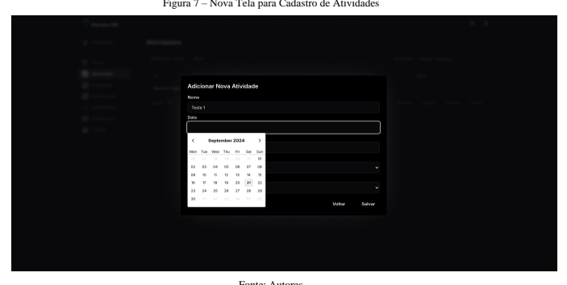
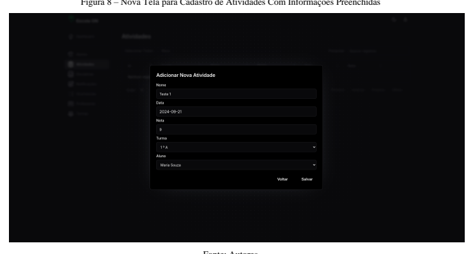
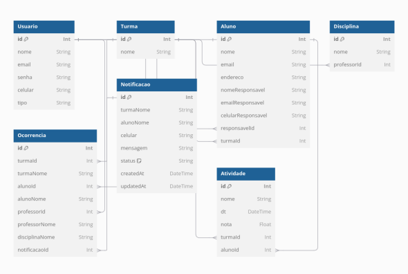

UNIVERSIDADE VIRTUAL DO ESTADO DE SÃO PAULO
Gustavo Henrique Bittencourt, 2210252 Ingrid Hayuni Campos de Moraes, 2212230 Larissa de Faria Machado, 2201836 Mauricio Faria Bellon, 1801201 Vitor Miura Higa, 2220510 Portal de Acompanhamento do Desempenho Escolar de Alunos para Pais e Responsáveis Indaiatuba, Santa Bárbara D'Oeste - SP
2024 UNIVERSIDADE VIRTUAL DO ESTADO DE SÃO PAULO
Portal de Acompanhamento do Desempenho Escolar de Alunos para Pais e Responsáveis Relatório Técnico-Científico apresentado na disciplina de Projeto Integrador para os cursos de Bacharel em Ciência de Dados e Engenharia da Computação da Universidade Virtual do Estado de São Paulo (UNIVESP). 

Indaiatuba, Santa Bárbara D'Oeste - SP
2024 BITTENCOURT, Gustavo; MORAES, Ingrid; MACHADO, Larissa; BELLON, Mauricio; HIGA, Vitor. **Portal para Acompanhamento do Desempenho Escolar de Alunos.** Relatório Técnico-Científico. Bacharelado em Ciência de Dados e Bacharelado em Engenharia da Computação - **Universidade Virtual do Estado de São Paulo**. Tutora: Lucirene Rodrigues. Polos Indaiatuba e Santa Bárbara D'Oeste, 2024.

## Resumo

Este trabalho visa abordar a dificuldade dos responsáveis em acompanhar o desempenho escolar de alunos do Ensino Médio e Fundamental Público. No Projeto Integrador I, discutiu-se a falta de comunicação entre a escola e os responsáveis. Agora, o foco é a dificuldade dos responsáveis em acessar os boletins escolares, já que muitos alunos não os entregam. Para minimizar esse problema, será implementada uma melhoria na aplicação desenvolvida anteriormente, otimizando o portal para que os responsáveis acessem facilmente atividades, notas e métricas de desempenho, permitindo identificar riscos de reprovação. Essa necessidade surgiu após conversas com responsáveis por alunos da Escola Estadual de Ensino Médio e Fundamental Professora Maria Trindade de Oliveira, em Ibatiba, Espírito Santo. Muitos relataram não receber os boletins devido à falta de comunicação eficaz com as crianças e adolescentes. Como solução, foi criada uma melhoria na plataforma digital do Projeto Integrador I, que facilita o acesso dos responsáveis ao desempenho escolar dos alunos, por meio de um acesso exclusivo e fácil de usar utilizando um portal web. PALAVRAS-CHAVE: Portal; Ensino Médio; Ensino Fundamental; Reprovação; Boletim Escolar; Responsáveis; Notas.

# Lista De Ilustrações

| FIGURA 1– DESIGN THINKING FRAMEWORK…...………………………………………10                                                                                                                                                                                        |
|-------------------------------------------------------------------------------------------------------------------------------------------------------------------------------------------------------------------------------------------------|
| FIGURA 2– API RESTFUL………………………………………………………….….……..12                                                                                                                                                                                            |
| FIGURA 3– TELA DE LOGIN DO SISTEMA MODO ESCURO……...…………...………..13 FIGURA 4– TELA DE LOGIN DO SISTEMA MODO CLARO………………...…….……..13                                                                                                               |
| FIGURA 5– FLUXOGRAMA DO SISTEMA………..………………………………………..14                                                                                                                                                                                         |
| FIGURA 6– TELA PRINCIPAL NOVA FUNCIONALIDADE CADASTRO DE ATIVIDADES……………………………………….…………………………… ……….15                                                                                                                                           |
| FIGURA 7– NOVA TELA PARA CADASTRO DE ATIVIDADES………..…..… …..…..15 FIGURA 8– NOVA TELA PARA CADASTRO DE ATIVIDADES COM INFORMAÇÕES PREENCHIDAS……………………...…………………….…………………….…...……..16 FIGURA 9– DIAGRAMA DO BANCO DE DADOS…………… ……..……………..…..17 |

# Sumário

|                                                                                                                                                                                                                                                                                                                                                                                                                                                                                                                                                                                                                                       |
|---------------------------------------------------------------------------------------------------------------------------------------------------------------------------------------------------------------------------------------------------------------------------------------------------------------------------------------------------------------------------------------------------------------------------------------------------------------------------------------------------------------------------------------------------------------------------------------------------------------------------------------|
| 1 INTRODUÇÃO…...……………………… ………………...6 2 DESENVOLVIMENTO……………………………………………………….….…… 7  2.1 OBJETIVOS……...…………...……… 7  2.2 JUSTIFICATIVA E DELIMITAÇÃO DO PROBLEMA 7  2.3 FUNDAMENTAÇÃO TEÓRICA … 8  2.4 METODOLOGIA..…………...……… 9  2.5 RESULTADOS PRELIMINARES: SOLUÇÃO INICIAL 11  2.5.1 Definição de API...………...……… 12  2.5.2 Plataforma Web ………...……… 12  2.5.3 Funcionalidades e Controle de Acesso por Perfil do Usuário 13  2.5.4 Banco de Dados ………...……… 16  2.5.5 Garantindo a Qualidade: Testes da Aplicação 18  2.5.6 Deploy e Acesso Remoto: Tornando a Aplicação Disponível 18 REFERÊNCIAS……………………………………………………….… ……...20 |

## 1 Introdução

A Constituição Federal de 1988, em seu artigo 205, consagra a educação como um direito de todos e um dever compartilhado entre o Estado e a família, assegurando o acesso igualitário à educação e a liberdade de aprender, ensinar, pesquisar e disseminar o conhecimento (Supremo Tribunal Federal, 2024). 

Complementando esse princípio, a Lei de Diretrizes e Bases da Educação Nacional (Lei nº 9.394/1996) reafirma a responsabilidade do Estado na promoção da educação, estabelecendo diretrizes, objetivos e normas a serem seguidas por todas as instituições educacionais no Brasil.

A participação dos responsáveis na vida escolar do aluno é fundamental para o seu desenvolvimento acadêmico e pessoal (TOKARNIA, 2019). Quando os responsáveis se envolvem ativamente no acompanhamento das atividades escolares, eles criam um ambiente de apoio e incentivo que fortalece a motivação e o desempenho dos estudantes. Essa participação também facilita a identificação de dificuldades e permite a intervenção precoce em situações que possam comprometer o aprendizado. Além disso, o engajamento dos responsáveis promove uma comunicação mais eficaz com a escola, contribuindo para a construção de um vínculo colaborativo que beneficia tanto o aluno quanto a instituição de ensino.

Dessa forma, identificamos diversos casos em que os responsáveis foram surpreendidos ao final do ano letivo com a notícia de que seus filhos haviam sido reprovados. Isso evidencia a importância de uma solução que permita o acompanhamento do desempenho escolar de maneira ágil, abrangente e eficaz.

Reconhecendo a necessidade de promover uma maior integração dos responsáveis no acompanhamento escolar, o grupo identificou uma oportunidade de aprimorar a plataforma desenvolvida no Projeto Integrador I. Nesse projeto, foi criado o Sistema Digital para Controle de Frequência de Alunos, que agora será expandido para permitir que os responsáveis acessem a plataforma e acompanhem as atividades e notas dos alunos. Essa expansão é particularmente importante, pois o baixo rendimento escolar frequentemente preocupa as famílias, que desejam estar mais envolvidas e informadas sobre o progresso dos estudantes (DELBONI, 2021). O objetivo é que o acesso seja feito de maneira simplificada, utilizando informações de fácil lembrança, como o e-mail do responsável, sem a necessidade de dados específicos, como a matrícula do aluno, que poderiam dificultar o processo. Os alunos serão vinculados aos responsáveis através desta informação, permitindo que, ao acessar a plataforma, o responsável visualize todas as informações e métricas relacionadas aos alunos sob sua responsabilidade.

O trabalho consiste em facilitar o acesso à plataforma web criada no Projeto Integrador I, 
permitindo que pais e responsáveis acompanhem o desempenho escolar dos alunos sem a necessidade de se deslocarem até a escola ou dependerem da entrega física das notas pelos alunos. A plataforma conta com um sistema robusto de armazenamento em banco de dados, garantindo uma gestão eficiente e segura das informações necessárias para os responsáveis. 

Essa abordagem facilita uma compreensão mais rápida e completa do desempenho escolar, servindo como um aviso prévio em caso de baixo rendimento evitando possível reprovação, caso medidas não sejam tomadas.

## 2 Desenvolvimento 2.1 Objetivos

O projeto em desenvolvimento é uma plataforma web, onde para isso foi utilizado a linguagem de programação *Javascript* com o *framework Nuxt.js,* juntamente com um banco de dados *SQLite*, onde além de registrar as informações e ocorrências dos alunos do Ensino médio e fundamental público, também será possível registrar as informações de notas de provas e atividades. Além disso, será possível acompanhar o desempenho do aluno com base em métricas comparativas, como a posição do aluno em relação ao desempenho médio da turma, indicando se ele está abaixo, na média ou acima. O acesso a essas informações será restrito ao aluno associado, por meio de um controle de acesso baseado no nível de permissões do usuário.

No geral, a plataforma visa possibilitar um melhor acompanhamento do desenvolvimento da aprendizagem do aluno de forma eficaz, garantindo assim o acesso remoto sem a necessidade do deslocamento até a instituição de ensino ou que o aluno faça a entrega em mãos do boletim escolar.

Ao integrar essas funcionalidades, o principal objetivo é possibilitar intervenções que evitem a reprovação ao final do ano letivo, fortalecer os laços entre escola e responsáveis, promover a participação ativa dos pais na educação dos filhos e contribuir para o sucesso acadêmico dos estudantes.

## 2.2 Justificativa E Delimitação Do Problema

Ao considerarmos a importância do envolvimento dos responsáveis na vida acadêmica de seus filhos, é fundamental abordar os desafios que muitos enfrentam ao tentar acompanhar o desempenho escolar. No Brasil, ainda é comum que os responsáveis dependam de boletins impressos para verificar as notas de seus filhos.

No entanto, a transição para boletins online trouxe desafios. O acesso às informações muitas vezes exigia dados específicos, como o número de matrícula do aluno, que nem sempre estavam facilmente acessíveis para os responsáveis. Além disso, a falta de treinamento adequado e a complexidade do sistema tornaram o processo de uso mais difícil, resultando em dificuldades para os pais navegarem e utilizarem a plataforma de forma eficaz.

Essa barreira no acesso às informações pode resultar em uma falta de acompanhamento contínuo do progresso escolar, o que pode levar a decepções, como a reprovação ao final do ano letivo. Responsáveis que não conseguem acessar o boletim digital, muitas vezes, permanecem desinformados sobre as notas e o desempenho da criança / adolescente ao longo do ano, perdendo a oportunidade de intervir e oferecer o suporte necessário.

Nosso projeto visa solucionar esse problema ao simplificar o acesso às informações acadêmicas. Ao permitir que os responsáveis acessem as notas e o desempenho dos alunos sem a necessidade de dados específicos, como a matrícula, mas utilizando informações mais acessíveis, como o e-mail, estamos facilitando a participação ativa na vida escolar dos alunos. Com isso, buscamos não apenas evitar reprovação por falta de desempenho no final do ano, mas também fortalecer a comunicação entre escola e família, promovendo um acompanhamento mais próximo e contínuo do progresso acadêmico.

Esse esforço contribui para um ambiente educacional mais inclusivo e acessível, onde os responsáveis se sentem mais engajados e capazes de participar ativamente do desenvolvimento escolar de seus filhos, evitando que a falta de informação se torne um obstáculo para o sucesso acadêmico.

## 2.3 Fundamentação Teórica

Os direitos educacionais assegurados pelo Estatuto da Criança e do Adolescente (ECA) 
garantem que todas as crianças e adolescentes tenham acesso à educação gratuita e de qualidade, promovida pelo Estado. O ECA também estabelece a obrigatoriedade da frequência escolar e reforça a escola como um ambiente de formação integral, que promove o desenvolvimento físico, emocional e intelectual dos estudantes. Além disso, o estatuto responsabiliza o poder público, as famílias e a sociedade pela permanência dos jovens na escola, combatendo a evasão escolar. Diante do avanço das necessidades educacionais e da crescente demanda por uma maior participação dos pais no acompanhamento da vida escolar de seus filhos, surgiu a necessidade de ampliar o projeto realizado no Projeto Integrador I com o papel de trazer novas tecnologias, criando uma plataforma com novos módulos voltados ao monitoramento de notas e atividades escolares.

A integração entre escola e responsáveis é um fator essencial para o sucesso acadêmico dos alunos, especialmente em situações em que a distância ou o baixo rendimento dificultam esse acompanhamento. Nesse sentido, a tecnologia desempenha um papel vital ao facilitar o acesso à informação e criar mecanismos que possibilitam um acompanhamento mais próximo e eficaz do desempenho dos estudantes. A expansão dessa plataforma promove uma maior participação dos pais, conectando-os ao ambiente escolar de maneira mais prática.

Adicionalmente, essa iniciativa está em consonância com os princípios de transparência e inclusão digital, ao permitir que tecnologias acessíveis sejam utilizadas por responsáveis que, em alguns casos, podem não estar familiarizados com sistemas mais complexos. O uso do e-mail como meio de vinculação entre aluno e responsável simplifica o processo de acesso, minimizando barreiras e aumentando o engajamento. Assim, o uso de uma interface amigável torna o acompanhamento mais eficiente e intuitivo.

Por fim, a integração dessa ferramenta tecnológica no ambiente educacional cria uma plataforma que, além de promover o acompanhamento escolar, estabelece uma cultura de comunicação constante entre a escola e os responsáveis. Isso não só contribui para o sucesso acadêmico dos estudantes, mas também auxilia na identificação e gestão de problemas de desempenho, permitindo que intervenções sejam feitas de forma mais ágil e assertiva.

## 2.4 Metodologia

Durante o desenvolvimento do nosso projeto, adotamos uma abordagem semelhante ao Design Thinking para entender, definir e abordar os desafios enfrentados por pais e responsáveis no acompanhamento da vida escolar dos estudantes do ensino médio público. O foco foi identificar soluções que facilitassem o acesso às informações acadêmicas, de modo a melhorar o envolvimento dos responsáveis. Com um acompanhamento mais ativo, os pais podem intervir de forma mais eficaz, auxiliando na melhoria do desempenho dos alunos e, consequentemente, na redução das taxas de reprovação, uma vez que, ao estarem cientes, têm a oportunidade de agir a tempo.

Figura 1 - Design Thinking Framework

Fonte: Objetivo Sorocaba. Disponível em: https://blog.objetivosorocaba.com.br/design-thinking-na-educacao/. Acesso 

em : 21/09/2024
Empatia: O grupo se dedicou a compreender as necessidades e perspectivas dos pais e responsáveis no acompanhamento da vida acadêmica de seus filhos. Por meio de conversas presenciais, conseguimos obter insights valiosos sobre os desafios que eles enfrentam. Após focarmos na visão da escola em nosso Projeto Integrador I, agora estamos priorizando a perspectiva de pais e responsáveis, com o objetivo de criar um sistema que atenda às necessidades de ambas as partes e promova uma melhoria para todos. Essa abordagem orientou o desenvolvimento das melhorias que serão implementadas em nosso sistema, garantindo que os pais estejam sempre informados e engajados no progresso acadêmico dos alunos.

Definição: Na primeira quinzena, após um consenso entre todos os membros do grupo, decidimos dar continuidade ao projeto iniciado no Projeto Integrador I, mudando o foco da perspectiva da escola para a dos pais e responsáveis. Realizamos um brainstorming que gerou diversas ideias e, após uma análise conjunta, optamos por implementar melhorias que permitam aos pais e responsáveis acompanharem a vida acadêmica dos alunos do ensino médio público de forma mais eficaz. Essa decisão foi fundamentada na necessidade de evitar surpresas desagradáveis ao final do período letivo, uma vez que muitos pais relataram dificuldades em acompanhar o boletim impresso, já que os alunos nem sempre o entregam em casa. Assim, nosso objetivo é fornecer aos responsáveis as informações necessárias para apoiar seus filhos e tomar medidas preventivas junto à escola, quando necessário.

Ideação: Com base na compreensão da problemática, o grupo gerou uma variedade de ideias criativas para o sistema, que permitirá aos pais e responsáveis acompanharem o desempenho acadêmico dos alunos de forma contínua. O foco é garantir que o acesso seja o mais simples possível, assim como a compreensão das informações exibidas, permitindo que todos entendam claramente a real situação do aluno. 

Prototipação: As ideias selecionadas serão prototipadas e testadas para avaliar sua viabilidade e eficácia. Durante essa fase, buscaremos validar as funcionalidades propostas, garantindo que atendam às necessidades dos pais e responsáveis, além de proporcionar uma experiência intuitiva e acessível.

Validação: Após a prototipagem, o sistema será apresentado a pais e responsáveis para coletar feedback direto sobre sua usabilidade e eficácia. O objetivo é verificar se as funcionalidades atendem às necessidades identificadas, garantindo que as informações sejam apresentadas de maneira clara e acessível. O feedback obtido será fundamental para refinarmos o sistema, ajustando-o conforme necessário para assegurar que realmente facilite o acompanhamento do desempenho acadêmico dos alunos.

## 2.5 Resultados Preliminares: Solução Inicial

Conforme discutido anteriormente, por meio do processo de *brainstorming e design thinking*, 
estamos aprimorando uma solução já desenvolvida para a escola, agora com um foco específico em pais e responsáveis. Essa melhoria visa enfrentar os desafios das reprovações de alunos, que frequentemente surpreendem os pais ao não terem conhecimento da situação acadêmica dos filhos. Durante nossas conversas, muitos responsáveis destacaram a dificuldade em acessar as notas, uma vez que os alunos muitas vezes não entregam as provas e boletins, além de não informar sobre os períodos de avaliação.

Com as melhorias propostas na plataforma, os pais e responsáveis terão acesso facilitado às informações acadêmicas dos alunos. A nova interface permitirá que eles visualizem notas, datas de provas e outras métricas importantes de forma clara e intuitiva. Assim, garantimos que os responsáveis estejam sempre informados e possam agir proativamente, evitando surpresas desagradáveis ao final do período letivo.

# 2.5.1 Definição De Api

Segundo Fielding (2000), uma API (Interface de Programação de Aplicações) é um conjunto de diretrizes e protocolos que possibilita a comunicação entre diferentes softwares de maneira padronizada. De forma simplificada, pode-se dizer que uma API funciona como uma ponte, permitindo que aplicativos e sistemas troquem dados e funcionalidades de maneira segura e eficiente, sem expor o código-fonte interno. Isso facilita a integração de diversos sistemas e a criação de novas aplicações com base em recursos já disponíveis. Em resumo, uma API permite que diferentes programas se comuniquem entre si e executem tarefas específicas de maneira automatizada.

Figura 2 - API RESTFUL
 Fonte: Astera Software. Disponível em: https://www.astera.com/pt/type/blog/rest-api-definition. Acesso em : 
21/09/2024

## 2.5.2 Plataforma Web

Uma plataforma web é um ambiente digital acessado por meio de navegadores de internet, que permite a criação, gerenciamento e interação de aplicativos e serviços online. Diferentemente de softwares tradicionais, que precisam ser instalados localmente em dispositivos específicos, as plataformas web operam na nuvem, possibilitando o acesso de qualquer lugar com conexão à internet (HOTMART, 2024).

A tela inicial da página de login foi projetada para oferecer uma experiência simples e intuitiva. Nela, os usuários podem inserir suas credenciais de acesso para se conectar à plataforma de forma rápida e segura, após o pré-cadastro realizado pela escola com o e-mail do responsável. A interface permite a escolha entre temas claro e escuro, proporcionando uma personalização que se adapta às preferências dos usuários e melhora a legibilidade em diferentes condições de iluminação em todas as telas da plataforma. Os elementos visuais são organizados de maneira clara, garantindo que pais e responsáveis identifiquem facilmente os campos necessários para autenticação e tenham um acesso eficaz às informações acadêmicas dos alunos.

 Figura 3 - Tela de Login do Sistema Modo Escuro 

Fonte: Autores Figura 4 - Tela de Login do Sistema Modo Claro

Fontes: Autores

## 2.5.3 Funcionalidades E Controle De Acesso Por Perfil Do Usuário

O sistema de gestão escolar foi desenvolvido inicialmente no Projeto Integrador I com o objetivo de criar uma plataforma intuitiva e eficiente para a administração escolar. Durante essa fase, foram implementadas funcionalidades essenciais, como o cadastro de alunos, professores, turmas e disciplinas, além do registro de ocorrências e envio de notificações aos responsáveis.

No sistema, todas as telas desenvolvidas no Projeto Integrador I são acessíveis pelo perfil de coordenador, que tem permissão para gerenciar as informações. Já os professores têm acesso apenas às funcionalidades relacionadas a ocorrências e atividades, podendo realizar registros delas. Os responsáveis, por sua vez, têm acesso limitado, podendo visualizar apenas os dados dos alunos vinculados a eles, sem a possibilidade de editar ou alterar informações.

Fonte: Autores
Com o avanço para o Projeto Integrador II, o foco se direciona ao desenvolvimento de novas funcionalidades que permitirão que responsáveis e pais acompanhem de forma mais efetiva a vida escolar dos alunos, além da nova funcionalidade para cadastro de atividades pelo professor, onde serão lançadas suas respectivas notas. 

Figura 6 - Tela Principal nova funcionalidade Cadastro de Atividades

Fonte: Autores Figura 7 - Nova Tela para Cadastro de Atividades

Fonte: Autores

Fonte: Autores
Essa continuidade busca integrar os responsáveis de maneira mais profunda ao ambiente escolar, oferecendo acesso a informações relevantes sobre o desempenho acadêmico e as atividades dos alunos. Com isso, será possível adotar medidas preventivas e corretivas, evitando possíveis reprovações e promovendo um acompanhamento mais proativo e colaborativo do desenvolvimento educacional. A evolução aplicada no projeto assegura uma gestão escolar mais transparente e colaborativa, atendendo às necessidades tanto da equipe escolar quanto dos responsáveis.

## 2.5.4 Banco De Dados

O banco de dados desempenha um papel central no sistema de gestão escolar, sendo responsável por armazenar todas as informações relacionadas à administração escolar, alunos, professores, turmas, disciplinas, ocorrências e dados dos responsáveis. A escolha de um banco de dados é essencial para garantir a integridade e segurança dessas informações, além de possibilitar um acesso rápido e eficiente para os diferentes tipos de usuários, como coordenadores, professores e responsáveis.

No sistema, o banco de dados foi projetado para organizar e categorizar os dados de forma clara e estruturada. Informações como cadastro de alunos e professores, registros de ocorrências, turmas e disciplinas são armazenadas de maneira relacional, garantindo consistência e fácil recuperação. Além disso, os responsáveis pelos alunos possuem acesso a um subconjunto de dados, com a capacidade de visualizar informações acadêmicas de seus filhos ou dependentes, mas sem a permissão de editar ou modificar nenhum registro.

Esse banco de dados também garante que as permissões de acesso sejam respeitadas, permitindo que coordenadores possam gerenciar todas as funcionalidades do sistema, enquanto professores têm permissões restritas às atividades de acompanhamento e registro de ocorrências, e os responsáveis têm apenas a capacidade de visualizar os dados dos alunos vinculados a eles. Para garantir a segurança e conformidade com a Lei Geral de Proteção de Dados (LGPD), o banco de dados utiliza técnicas de criptografia e controle de acesso, assegurando que as informações dos usuários estejam sempre protegidas.

Por fim, a escalabilidade do banco de dados foi projetada para suportar o crescimento do sistema, possibilitando a adição de novas funcionalidades e mais usuários ao longo do tempo, sem comprometer a performance ou a segurança.

Figura 9 - Diagrama do Banco de Dados Fonte: Autores
# 2.5.5 Garantindo A Qualidade: Testes Da Aplicação

Testes são uma parte essencial do ciclo de vida do desenvolvimento de software, assegurando a confiabilidade, estabilidade e manutenção do código. Em aplicações baseadas no *Nuxt.js*, um framework construído sobre o *Vue.js*, os testes podem ser realizados em diferentes níveis: testes unitários, de integração e de ponta a ponta (E2E).

1. **Testes Unitários**: Testes unitários verificam funcionalidades isoladas da aplicação, como componentes, funções ou métodos. Eles garantem que essas unidades de código funcionem conforme esperado de forma independente.

2. **Testes de Integração**: Testes de integração validam a interação entre diferentes módulos ou componentes, garantindo que funcionem bem juntos. Esse tipo de teste é ideal para testar a lógica de interação entre a UI e o estado da aplicação.

3. **Testes de Ponta a Ponta (E2E)**: Testes E2E verificam o funcionamento de toda a aplicação como um todo, desde a interface do usuário até o *backend*. Eles simulam interações reais de um usuário, validando fluxos completos. Em conclusão, a implementação de uma estratégia de testes eficaz em aplicações é fundamental para garantir a qualidade e a robustez do software. Testes unitários, de integração e de ponta a ponta trabalham juntos para identificar falhas em diferentes níveis, proporcionando confiança no funcionamento da aplicação (CUSTODIO, 2023). Essa prática não apenas previne problemas futuros, mas também fortalece a base do desenvolvimento, permitindo que a equipe se concentre em inovações e melhorias, resultando em uma experiência superior para os usuários.

## 2.5.6 Deploy E Acesso Remoto: Tornando A Aplicação Disponível

O deploy desempenhara o papel de hospedagem da aplicação, na qual disponibilizara a aplicação na Web para os usuários. A plataforma escolhida será o IaaS (Infraestrutura como serviço) Fly.io, pois permite aos desenvolvedores implantar, gerenciar e escalar aplicações full-stack em servidores distribuídos globalmente. Sendo assim, o *fly.io* acaba sendo uma ótima opção para a nossa aplicação, pois trazem vantagens como Suporte a aplicações full-stack, banco de dados e CLI simples.

1. Suporte a **Aplicações Full-Stack:** A comunicação entre os serviços e o gerenciamento do ambiente acabam sendo muito fáceis, pois no Fly.io é possível hospedar tanto o front-end (Nuxt) quanto o back-end (Prisma) na mesma instancia.

2. **CLI Simples:** Devido a sua CLI extremamente simples, utilizando o Fly.io é possível realizar o deploy de uma aplicação com simples comandos básicos, após a preparação do ambiente.

3. **Banco de Dados:** Atualmente nosso back-end está configurado com um banco de dados local SQLite, ao realizar o deploy será necessário migrar para um banco em nuvem. Contudo, o Fly.io oferece uma integração com o Postgres, sendo possível criar instancias diretamente em usa infraestrutura, evitando problemas de latência. Dessa forma, a escolha de utilizar o Fly.io torna-se evidente. Embora essa plataforma possa não ser a mais adequada para aplicações complexas e com arquiteturas baseadas em micro serviços, ela se mostra perfeita para nossa aplicação. Isso se deve à sua simplicidade de configuração e à oferta de créditos gratuitos, que atendem plenamente às necessidades da nossa aplicação, proporcionando uma solução eficiente e de custo zero.

## Referências

Supremo Tribunal Federal. **Artigo 205**. Disponível em: https://portal.stf.jus.br/constituicaosupremo/artigo.asp?abrirBase=CF&abrirArtigo=205\#:~:text=Da%20Educa%C3%A7%C3%A3o-,A rt.,sua%20qualifica%C3%A7%C3%A3o%20para%20o%20trabalho. Acesso: 21 ago. 2024. Planalto. **Lei nº 9.394, de 20 de dezembro de 1996**. Disponível em: https://www.planalto.gov.br/ccivil_03/leis/l9394.htm. Acesso: 21 ago. 2024. TOKARNIA, Mariana. **Participação de pais na vida escolar melhora desempenho dos filhos**. Agência Brasil, 28 set. 2019. Disponível em: https://agenciabrasil.ebc.com.br/educacao/noticia/201909/participacao-de-pais-na-vida-escolar-melhora-desempenho-dos-filhos. Acesso: 21 ago. 2024. DELBONI, Carolina. **Baixo rendimento escolar preocupa famílias**. Estadão, 10 mai. 2021. Disponível em: https://www.estadao.com.br/emais/carolina-delboni/baixo-rendimento-escolarpreocupa-familias/. Acesso: 21 ago. 2024. HOTMART. **Plataformas Digitais: tipos e mais usadas**. Disponível em: https://hotmart.com/ptbr/blog/plataformas-digitais. Acesso: 21 set. 2024. FIELDING, Roy. **Architectural Styles and the Design of Network-based Software Architectures**. 2000. 162 f. Tese (Doutorado) - Curso de Information And Computer Science, University Of California, Irvine, Ca, 2000. Disponível em: https://www.ics.uci.edu/~fielding/pubs/dissertation/top.htm. Acesso em: 21 set. 2024. CUSTODIO, Fernando. **A Importância dos Testes no Desenvolvimento de Software**. FWC Tecnologia, 08 abr. 2023. Disponível em: https://fwctecnologia.com/blog/post/importancia-testesdesenvolvimento-software. Acesso: 21 set. 2024. BRASIL. **Estatuto da criança e do adolescente** (1990). 4. Ed. Brasília: Câmara dos Deputados, Coordenação de Publicação, 2003.